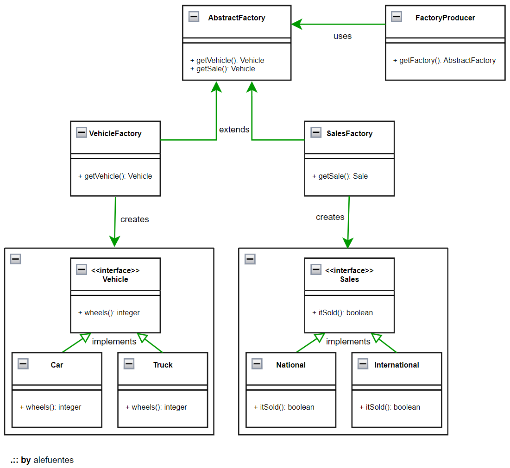

# DESIGN PATTERNS : ABSTRACT FACTORY : theory
[HOME](../README.md) 

> 

This design has a part of it the [`design factory method`](./README-factorymethod.md):

<p align = "center">

</p>
<p align = "center">
Fig.1 - UML - abstract factory
</p>

In this figure, we has two family fo factory, a `vehicle` and a `sales`.

This facotories are gerency for `abtract factory`, that from `factory producer` whe can selected what factory we can use, a next, select your function.

This example (in java), I will show the code, with its different parts:

**Vehicle** Interface

    ```java
    package creational;

    public interface IFactoryMethodVehicle {
        public int wheels();

    }
    ```
**Interface Vehicle** implementation
* car
    ```java
    package creational.implementation;

    import creational.IFactoryMethodVehicle;

    public class Car implements IFactoryMethodVehicle {

        private int wheels;
        
        public Car() {
            // setting our wheels for default
            this.wheels = 4;
        }

        @Override
        public int wheels() {
            return this.wheels;
        }
        
        @Override
        public String toString() {
            return String.format("CARD: number of wheels: %d", this.wheels);
        }

    }
    ```
* truck
    ```java
    package creational.implementation;

    import creational.IFactoryMethodVehicle;

    public class Truck implements IFactoryMethodVehicle {
        private int wheels;

        public Truck() {
            // setting our wheels for default
            this.wheels = 18;
        }
        
        @Override
        public int wheels() {
            
            return this.wheels;
        }

        @Override
        public String toString() {
            return String.format("TRUCK: number of wheels: %d", this.wheels);
        }

    }
    ```
* Vehicle empty
    ```java
    package creational.implementation;

    import creational.IFactoryMethodVehicle;

    public class VehicleEmpty implements IFactoryMethodVehicle {

        @Override
        public int wheels() {
            System.out.println("Don't specified vehicle");
            return 0;
        }
        
        @Override
        public String toString() {
            return "EMPTY: Don't specified vehicle, number of wheels: 0";
        }

    }
    ```
**Sales** interface

```java
package creational;

public interface IFactoryMethodSales {
	public boolean itSold();
}
```
**Interface Sales** implementation
* National
    ```java
    package creational.implementation;

    import creational.IFactoryMethodSales;

    public class National implements IFactoryMethodSales {

        private boolean itSold;
        
        public National() {
            this.itSold = false;
        }
        
        @Override
        public boolean itSold() {
            return this.itSold;
        }

        @Override
        public String toString() {
            return String.format("NATIONAL: it sold from national: %s", this.itSold);
        }
    }
    ```
* Internacional
    ```java
    package creational.implementation;

    import creational.IFactoryMethodSales;

    public class International implements IFactoryMethodSales {

        private boolean itSold;
        
        public International() {
            this.itSold = false;
        }
        
        @Override
        public boolean itSold() {
            return this.itSold;
        }

        @Override
        public String toString() {
            return String.format("INTERNATIONAL: it sold from international: %d", this.itSold);
        }

    }
    ```
**Abstract Factory** interface
```java
package creational;

public interface AbstractFactory {
	IFactoryMethodVehicle getVehicle(String type);
	IFactoryMethodSales getSales(String type);

}
```
**Interface Sales** implementation
* for connect to vehicle
    ```java
    import creational.AbstractFactory;
    import creational.IFactoryMethodSales;
    import creational.IFactoryMethodVehicle;
    import creational.implementation.Car;
    import creational.implementation.Truck;
    import creational.implementation.VehicleEmpty;

    public class ConnectionVehicleFactory implements AbstractFactory {

        @Override
        public IFactoryMethodVehicle getVehicle(String type) {
            if (type == null)
                return new VehicleEmpty();

            switch (type) {
            case ("CAR"):
                return new Car();
            
            case ("TRUCK"):
                return new Truck();

            default:
                // if don't defined a valid vehicle, return a empty vehicle
                return new VehicleEmpty();
            }
        }

        @Override
        public IFactoryMethodSales getSales(String type) {
            // This class cannot have the responsibility with sales.
            return null;
        }

    }
    ```
* for connect to sales
```java
import creational.AbstractFactory;
import creational.IFactoryMethodSales;
import creational.IFactoryMethodVehicle;
import creational.implementation.Car;
import creational.implementation.International;
import creational.implementation.National;
import creational.implementation.SalesEmpty;
import creational.implementation.Truck;
import creational.implementation.VehicleEmpty;

public class ConnectionSaleFactory implements AbstractFactory {

	@Override
	public IFactoryMethodVehicle getVehicle(String type) {
		// This class cannot have the responsibility with vehicles.
		return null;
	}

	@Override
	public IFactoryMethodSales getSales(String type) {
		if (type == null)
			return new SalesEmpty();

		switch (type) {
		case ("NATIONAL"):
			return new National();
		
		case ("INTERNATIONAL"):
			return new International();

		default:
			// if don't defined a type of sales, return a empty sales
			return new SalesEmpty();
		}
	}

}
```
**Testing**
```java
	private static void TestingAbstractFactory() {
		System.out.println("Testing Abstract Factory\n----------");
		AbstractFactory factoryVehicle = FactoryProducer.getFactory("VEHICLE");
		IFactoryMethodVehicle vehicle = factoryVehicle.getVehicle("CAR");
		System.out.println(vehicle.toString());
		
		AbstractFactory factorySales = FactoryProducer.getFactory("SALES");
		IFactoryMethodSales sales = factorySales.getSales("NATIONAL");
		System.out.println(sales.toString());
	}
```
**Results**
```shell
Testing Abstract Factory
----------
CARD: number of wheels: 4
NATIONAL: it sold from national: false
```
