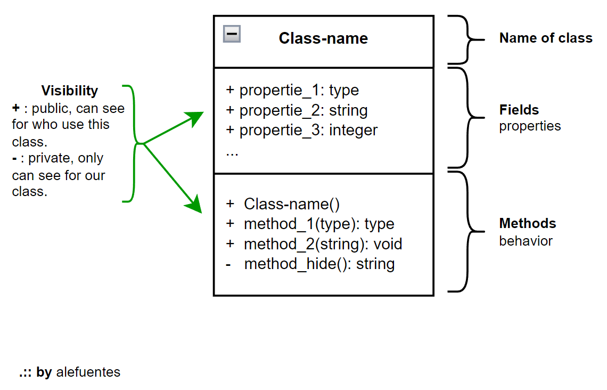
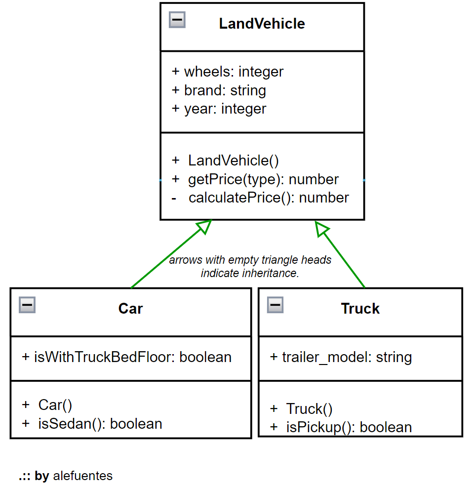

# DESIGN PATTERNS : OOP : theory
[HOME](../README.md) 
> 

One first step inner [OOP (Object-Oriented Programming)][link-oop-wkp].

This is a concept that has when a language has certain characteristics, such as wrapping pieces of data, where has a properties and behavior. This pieces called `objects`, but when this `objects` is create for a programmmer is called `classes`. 

This is can be representation (using [UML][link-uml-wkp]) in a grid called `class diagram`, one example of it's:

Fig.1 - UML - singleton

One `object` is how a abstraction the one object in the reality, exemplo, one car. 

Inner the diagram, we has:

* name of class, example `car`.
* your properties, exemplo `color`, `brand`, `whells`, etc.
* your behavior, exemplo show your color how `getColor()`, what year is it how `getYear()`, price how `getPrice()`, etc.

    this behavior is public, this means that whoever uses this class can call these methods. But you can also have hidden methods, to use on actions that only makes sense to use inside the object, like calculating its final price based on the year of build, etc.

## Others behaviors

In `OOP`, we have some behavior, an abstraction from real life, like inheritance.
Example, what is the difference between a car and a bus, truck, or bicycle (ground transportation)?

If they all have wheels, and they have a transition system, etc. 

Ok, they are all a 'land vehicle'. God, here has our first inheritance:

Fig.1 - UML - ineritance between objects

<!-- Links and tools -->
[link-uml-wkp]: https://en.wikipedia.org/wiki/Unified_Modeling_Language
[link-oop-wkp]: https://en.wikipedia.org/wiki/Object-oriented_programming