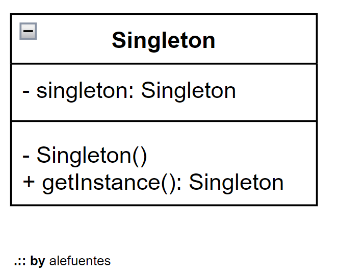
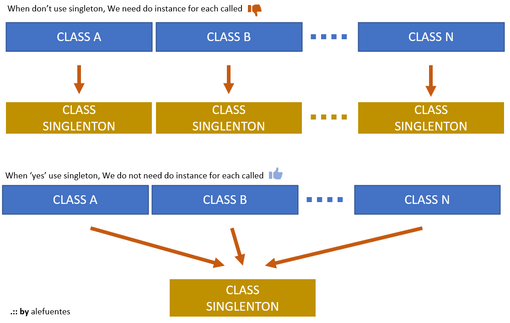

# DESIGN PATTERNS : SINGLETON : theory
[HOME](../README.md) 

> 


In this site [Tutorial-Point][link-tutorialpoint-singleton] or [Source-Making][link-sourcemaking-singleton] has good theory about this `designer pattern`.

The pattner which enabled do create one instance of our object in our project called `singleton`.

<p align = "center">

</p>
<p align = "center">
Fig.1 - UML - singleton
</p>

Imagine one class that called `getMyCities` and has  a unique responsability, that is get for us to list of city of our country, and imagine that our project or app has one million of users. :'-( 

You think this enviroment, one million of instance to `getMyCities`.
In this situation, where this design pattern doing your fantastic apresentation. 

Its allow do one unique instance, where all other objects that need it, can do consulting it.


<p align = "center">

</p>
<p align = "center">
Fig.1 - design pattern - singleton
</p>

We class cities can look like it:

```java
package creational;

public class City {

	// where I start or finish my instance.
	private static City myCities;
	
	// this constructor how 'private', the this form, we can avoid that some user want instantiated it.
	private City() {		
	}
	
	// here is where singleton do work, with our type of instance (key word) 'static' 
	public static City getMyCities() {
		if(myCities == null) {
			myCities = new City();
		}
		return myCities;
	}
	
	public void connect() {
		System.out.println("You city is on");
	}
	
	public void disconnect() {
		System.out.println("You city is off");
	}
	
}
```
to continue, using it:

```java
import creational.City;

public class DesignPatternsApp {

	public static void main(String[] args) {
		TestingSingleton();
	}

	private static void TestingSingleton() {
		// If we try create we class with private constructor, we get error of compilation
		//City myCity = new City();
		
		City myCity = City.getMyCities();
		myCity.connect();
		myCity.disconnect();
		
		System.out.println(String.format("Is myCity of type City: " + (myCity instanceof City)));
		
	}
}
```

After executing, our result is:

```shell
You city is on
You city is off
Is myCity of type City: true
```

## Conclution

`Singleton` is a good practice for when we need one same object for all cycle life of our project. It's good since help with us save resources of hardware (memory, processing, etc).

<!-- links and tools -->
[link-tutorialpoint-singleton]: https://www.tutorialspoint.com/design_pattern/singleton_pattern.htm
[link-sourcemaking-singleton]: https://sourcemaking.com/design_patterns/singleton