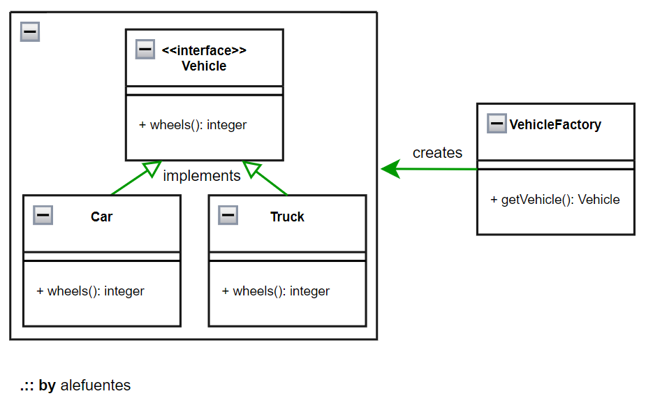

# DESIGN PATTERNS : FACTORY METHOD   : theory
[HOME](./README.md) 

> 

In this `design pattern` we dont do instance one object wath we need, but yes ask to factory class that do create one object (that we need) for we.

<p align = "center">

</p>
<p align = "center">
Fig.1 - UML - factory method
</p>

In this `design pattern`, a class of type `interface` is created, where it is defined which methods are needed. The class that implements this interface inherits this behavior.

In the next example, we cannot instance `Car` or `Truck`, but yes we ask to `VehicleFactory` that created these objects.

**Interface**
```java
package creational;

public interface IFactoryMethodVehicle {
	public int wheels();

}
```

**Implementation to interface**
* car
    ```java
    package creational.implementation;

    import creational.IFactoryMethodVehicle;

    public class Car implements IFactoryMethodVehicle {

        private int wheels;
        
        public Car() {
            // setting our wheels for default
            this.wheels = 4;
        }

        @Override
        public int wheels() {
            return this.wheels;
        }
        
        @Override
        public String toString() {
            return String.format("CARD: number of wheels: %d", this.wheels);
        }

    }
    ```
* truck
    ```java
    package creational.implementation;

    import creational.IFactoryMethodVehicle;

    public class Truck implements IFactoryMethodVehicle {
        private int wheels;

        public Truck() {
            // setting our wheels for default
            this.wheels = 18;
        }
        
        @Override
        public int wheels() {
            
            return this.wheels;
        }

        @Override
        public String toString() {
            return String.format("TRUCK: number of wheels: %d", this.wheels);
        }

    }
    ```
* empty vehicle
    ```java
    package creational.implementation;

    import creational.IFactoryMethodVehicle;

    public class VehicleEmpty implements IFactoryMethodVehicle {

        @Override
        public int wheels() {
            System.out.println("Don't specified vehicle");
            return 0;
        }
        
        @Override
        public String toString() {
            return "EMPTY: Don't specified vehicle, number of wheels: 0";
        }

    }
    ```

**Factory**
```java
import creational.IFactoryMethodVehicle;
import creational.implementation.Car;
import creational.implementation.Truck;
import creational.implementation.VehicleEmpty;

public class FactoryMethodVehicleFactory {

	public IFactoryMethodVehicle getVehicle(String type) {
		if (type == null)
			return new VehicleEmpty();

		switch (type) {
		case ("CAR"):
			return new Car();
		
		case ("TRUCK"):
			return new Truck();

		default:
			// if don't defined a valid vehicle, return a empty vehicle
			return new VehicleEmpty();
		}
	}
}
```

**Results**
```shell
CARD: number of wheels: 4
TRUCK: number of wheels: 18
EMPTY: Don't specified vehicle, number of wheels: 0
```
## Conclution

This practice is good, because we do not generate a coupling with a method (exemplo vehicle, car, truck, etc). The only coupling is with the interface.

This is good since it is easy to create new adapters (coupled with the interface), with new behaviors, that may be needed in the future.