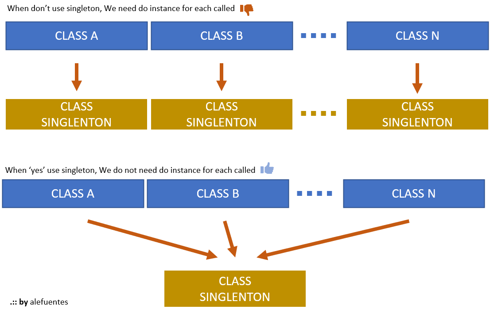

# DESIGN PATTERNS : SINGLETON : theory
[HOME](./README.md) 

In this site [Tutorial-Point][link-tutorialpoint-singleton] or [Source-Making][link-sourcemaking-singleton] has good theory about this `designer pattern`.

Fig.1 - design pattern - singleton

<!-- links and tools -->
[link-tutorialpoint-singleton]: https://www.tutorialspoint.com/design_pattern/singleton_pattern.htm
[link-sourcemaking-singleton]: https://sourcemaking.com/design_patterns/singleton